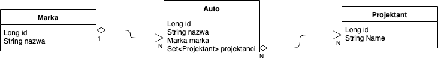

# Modele/Encje - Hibernate

Uzupełnij modele (Auto, Marka, Projektant) tak żeby spełniały poniższy diagram:

Użyj adnotacji takich jak:

1. [Entity](https://docs.oracle.com/javaee/7/api/javax/ws/rs/client/Entity.html) 
2. [Id](https://docs.oracle.com/javaee/7/api/javax/persistence/Id.html)
3. [GeneratedValue](https://docs.oracle.com/javaee/7/api/javax/persistence/GeneratedValue.html)
4. [OneToMany](https://docs.oracle.com/javaee/7/api/javax/persistence/OneToMany.html)
5. [ManyToMany](https://docs.oracle.com/javaee/7/api/javax/persistence/ManyToMany.html)
6. [ManyToOne](https://docs.oracle.com/javaee/7/api/javax/persistence/ManyToOne.html)

Odsyłacze prowadzą do dokumentacji gdzie są świetne przykłady jak użyć danej adnotacji :) 

**CZYTAJ UWAŻNIE DOKUMENTACJE**

Po dokończeniu implementacji encji nie zapomnij dodać zaanotowanych klas do konfiguracji (H2Connector)

Teraz przejdź do klasy App

Stworzone i połączone są tam wszystkie modele

Wykonaj polecenia oznaczone *TODO*

Jezeli do bazy zostaną zapisane 3 auta razem ze swoimi relacjami możesz przejść dalej:

git checkout manipulacja-danymi